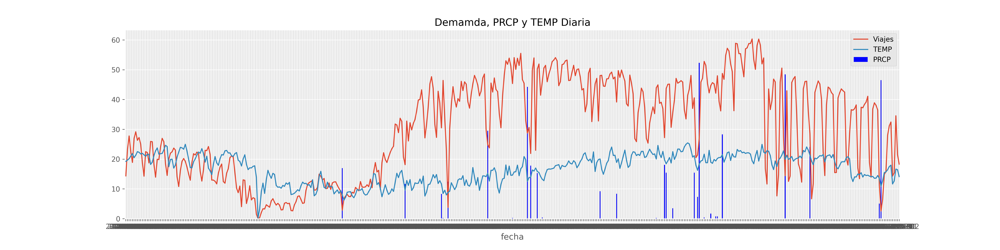
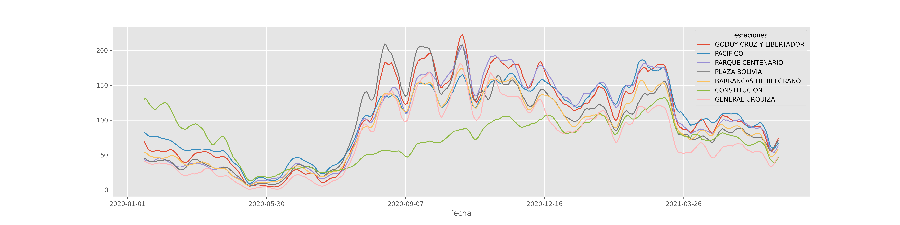
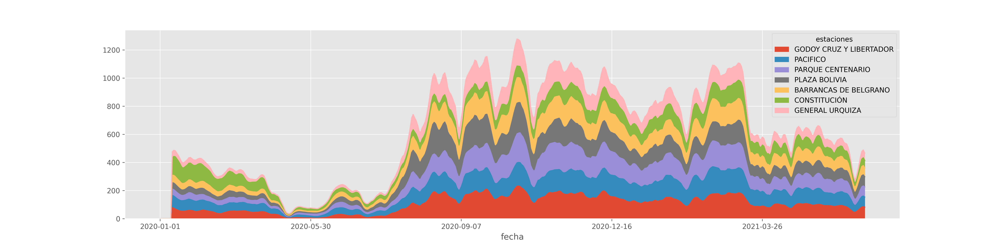
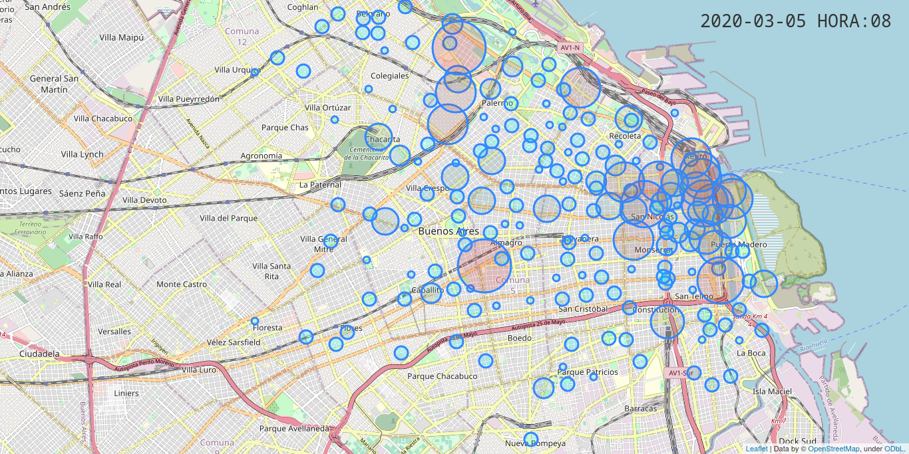

# Business Intelligence aplicado al servicio de *bicing* de la Ciudad Autónoma de Buenos Aires

Este es un estudio preliminar de los viajes realizados en el sistema público de
bicicletas de la Ciudad de Buenos Aires durante todo el año 2020 y el primer
semestre de 2021.

Se prepararon más de 3 millones de registros de viajes y se adquirieron más de
13000 datos climáticos horarios. Se comprobó la incidencia
del estado del clima, emparejando dichos recorridos a las observaciones
horarias meteorológicas para el mismo período de tiempo.

Se estudió el efecto modulador periodico semanal de la estacionalidad días
hábiles- fines de semana en uso del servicio además de los acontecimientos
eventuales del tipo festividades, feriados nacionales o días
no laborales.

**Palabras clave:** regeneración digitalmente inclusiva, servicios electrónicos,
códigos de diseño basados en formularios, gobernanza, ciudades inteligentes,
trayectorias de conocimiento, planes maestros, redes, 
transición

Los sistemas de \textit{bicing} son un medio de transporte que comenzó a implementarse a
fines de la primera década de los 2000~\cite{demaio2009bike}. Están
constituidos por bicicletas de accesso público y estaciones donde los usuarios
las retiran y, luego de su uso, las estacionan.

Debido a su popularidad y al hecho de que persistan la información sobre el uso
que le dan lo usuarios, se realizaron diversos estudios sobre los mismos a
mitad de la década pasada~\cite{OBrien2014}~\cite{jensen2010characterizing}
~\cite{lathia2012measuring}. Dichos análisis hacían énfasis en describir los
patrones de uso de dichos sistemas de transporte y la topología de los mismos. 

Dado a que las propiedades observables del sistema de ~\textit{bicing} pueden
servir para generar \textit{insights} sobre los patrones de uso que le dan los
usuarios se juzga relevante realizar nuevos análisis del mismo teniendo en
cuenta el contexto actual de emergencia sanitaria. Se puede afirmar a priori
que las inferencias obtenidas a partir del análisis de datos de dicho sistema
de transporte pueden facilitar la comprensión y discernimiento de nuevos
patrones de uso, así como también ser de utilidad para la empresa que gestiona
dicho servicio.

# Metodología

Con el fin de esclarecer la información a analizar,se produjeron subconjuntos de
datos derivados de contabilizar las salidas, arribos y usuarios.  

Otras características que se desarrollaron son las del tipo de recorrido, ida
de una estación a otra o bien, vuelta a la misma estación. 

El cálculo de la distancia del viaje derivó en la posibilidad de establecer la
velocidad de desplazamiento de los usuarios y a partir de ello desarrollar
múltiples características.

Establecer la relación entre el origen y destino de cada viaje a los
información de cada estación habilitó estructurar en nubes de puntos espaciales
lo que permitió analizar diversas propiedades, para múltiples ventanas de
tiempo con diferentes frecuencias de muestreo.  

Se desarrolló un modelo basado en aprendizaje automático (ML) de predicción de
demanda y prescripción de suministro para cada estación dado el input del dato
del tiempo.

- - - 

[**Bicing BA - VIDEO: FECHA DE MAYOR DEMANDA**](https://www.youtube.com/watch?v=_muR3drqs_Y)

